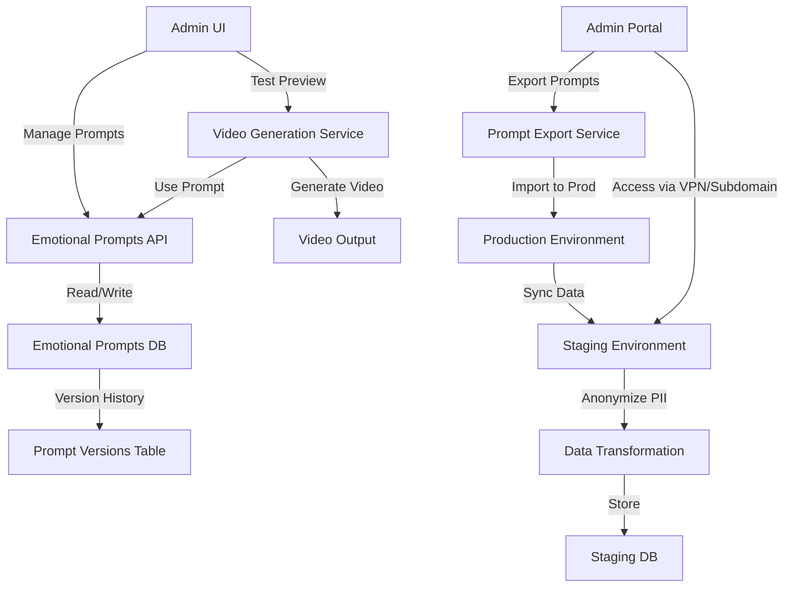
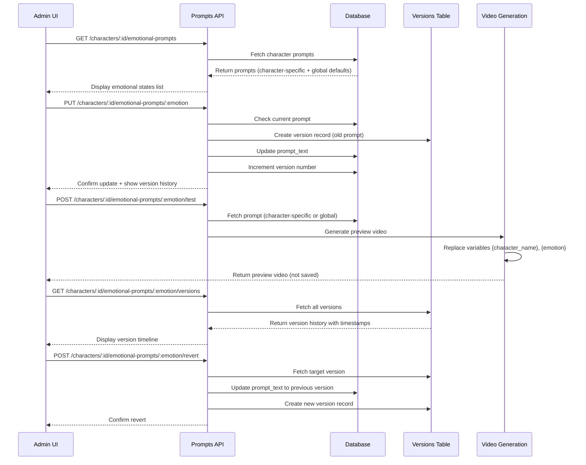
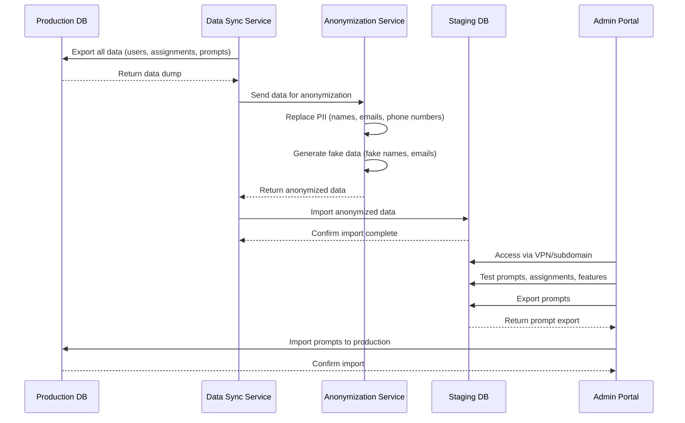
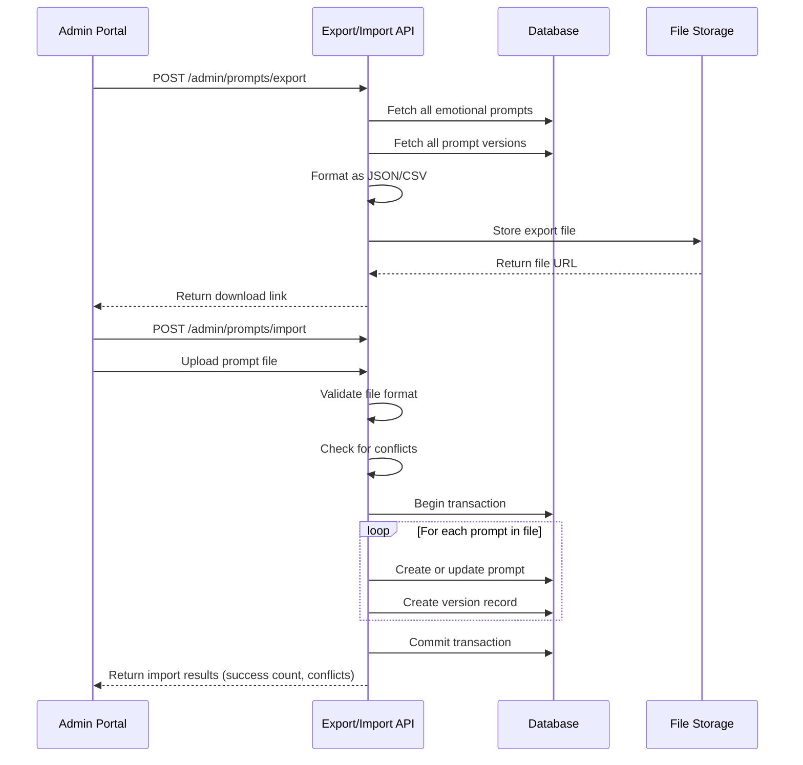

# Design Document: Advanced Features

## Overview

Phase 10 implements two major systems: an Emotional States Prompts Module for managing character-specific and global emotional state prompts with version control, and a Staging Environment for safe admin testing and feature validation. The Emotional States Prompts Module provides a two-level UI navigation system (character selection → emotional states list) with character-emotion matrix management, version history, and test preview capabilities. The Staging Environment mirrors production with isolated infrastructure, anonymized data sync, and admin-only access, enabling safe testing of prompts, assignments, and new features before production deployment.

## Architecture



## Sequence Diagrams

### Emotional Prompt Management Flow



### Staging Environment Data Sync Flow



### Prompt Export/Import Flow



## Components and Interfaces

### Component 1: Emotional Prompts Service

**Purpose**: Manages character-emotion matrix with version control, supporting character-specific overrides and global defaults.

**Interface**:
```typescript
interface EmotionalPromptsService {
  // Get all emotional prompts for a character
  getCharacterPrompts(characterId: string): Promise<CharacterPrompts>
  
  // Get specific emotional prompt (character-specific or global default)
  getPrompt(characterId: string, emotion: string): Promise<Prompt>
  
  // Update emotional prompt for character
  updatePrompt(characterId: string, emotion: string, promptText: string, updatedBy: string): Promise<Prompt>
  
  // Get global default prompt for emotion
  getGlobalPrompt(emotion: string): Promise<GlobalPrompt>
  
  // Update global default prompt
  updateGlobalPrompt(emotion: string, promptText: string, updatedBy: string): Promise<GlobalPrompt>
  
  // Get version history for prompt
  getPromptVersions(characterId: string, emotion: string): Promise<PromptVersion[]>
  
  // Revert prompt to specific version
  revertPrompt(characterId: string, emotion: string, versionId: string, revertedBy: string): Promise<Prompt>
  
  // Get prompt with variable substitution
  getResolvedPrompt(characterId: string, emotion: string): Promise<string>
}
```

**Responsibilities**:
- Manage character-specific emotional prompts
- Manage global default prompts per emotion
- Enforce character-specific overrides of global defaults
- Track version history for all prompt changes
- Support prompt variable substitution ({character_name}, {emotion})
- Provide audit trail of who changed what and when

### Component 2: Prompt Test Service

**Purpose**: Generates preview videos using prompts without persisting changes, enabling safe testing.

**Interface**:
```typescript
interface PromptTestService {
  // Generate preview video for testing
  generatePreview(characterId: string, emotion: string, promptText?: string): Promise<PreviewVideo>
  
  // Get preview status
  getPreviewStatus(previewId: string): Promise<PreviewStatus>
  
  // Cancel preview generation
  cancelPreview(previewId: string): Promise<void>
  
  // Clean up expired previews
  cleanupExpiredPreviews(olderThan: Date): Promise<number>
}
```

**Responsibilities**:
- Generate temporary preview videos for testing
- Use provided prompt or fetch from database
- Apply variable substitution
- Track preview generation status
- Clean up preview files after expiration (24 hours)
- Log preview generation for audit trail

### Component 3: Staging Environment Manager

**Purpose**: Manages staging instance configuration, data sync, and admin access control.

**Interface**:
```typescript
interface StagingEnvironmentManager {
  // Get staging environment status
  getStatus(): Promise<StagingStatus>
  
  // Sync data from production to staging
  syncData(options: SyncOptions): Promise<SyncResult>
  
  // Get sync status and history
  getSyncStatus(): Promise<SyncStatusInfo>
  
  // Verify admin access
  verifyAdminAccess(userId: string): Promise<boolean>
  
  // Get staging configuration
  getConfiguration(): Promise<StagingConfig>
  
  // Update staging configuration
  updateConfiguration(config: Partial<StagingConfig>): Promise<StagingConfig>
}
```

**Responsibilities**:
- Manage staging database and storage isolation
- Coordinate data sync from production
- Enforce admin-only access via VPN/subdomain
- Track sync status and history
- Manage staging-specific configuration
- Provide environment health checks

### Component 4: Data Anonymization Service

**Purpose**: Transforms production data to remove PII before staging sync.

**Interface**:
```typescript
interface DataAnonymizationService {
  // Anonymize user data
  anonymizeUsers(users: User[]): Promise<AnonymizedUser[]>
  
  // Anonymize assignment data
  anonymizeAssignments(assignments: Assignment[]): Promise<AnonymizedAssignment[]>
  
  // Generate fake data for replacement
  generateFakeData(type: 'name' | 'email' | 'phone', count: number): Promise<string[]>
  
  // Create anonymization mapping for audit trail
  createMapping(original: string, anonymized: string, type: string): Promise<void>
}
```

**Responsibilities**:
- Replace user names with fake names
- Replace emails with fake emails
- Replace phone numbers with fake numbers
- Maintain mapping for audit purposes
- Ensure consistent anonymization across related records
- Support selective anonymization (some fields preserved)

### Component 5: Prompt Export/Import Service

**Purpose**: Enables safe transfer of prompts between staging and production environments.

**Interface**:
```typescript
interface PromptExportImportService {
  // Export all prompts to file
  exportPrompts(options: ExportOptions): Promise<ExportResult>
  
  // Import prompts from file
  importPrompts(file: File, options: ImportOptions): Promise<ImportResult>
  
  // Validate import file
  validateImportFile(file: File): Promise<ValidationResult>
  
  // Get import preview (show what will be imported)
  getImportPreview(file: File): Promise<ImportPreview>
  
  // Handle import conflicts
  resolveConflicts(conflicts: Conflict[], resolution: ConflictResolution): Promise<void>
}
```

**Responsibilities**:
- Export prompts in standardized format (JSON/CSV)
- Import prompts with validation
- Detect and handle conflicts (prompt already exists)
- Support merge strategies (overwrite, skip, merge versions)
- Maintain version history during import
- Log all import/export operations

## Data Models

### Model 1: emotional_prompts

```typescript
interface EmotionalPrompt {
  id: string                    // UUID
  character_id: string          // Reference to character
  emotion: string               // Emotion state (idle, excited, sad, angry, etc.)
  prompt_text: string           // The actual prompt
  version: number               // Current version number
  is_global_override: boolean   // Whether this overrides global default
  created_by: string            // Admin who created
  created_at: Date
  updated_by: string            // Admin who last updated
  updated_at: Date
  deleted_at?: Date             // Soft delete for audit trail
}
```

**Validation Rules**:
- `character_id` must reference valid character
- `emotion` must be one of: idle, excited, sad, angry, confused, happy, surprised, etc.
- `prompt_text` must not be empty
- `version` must be positive integer
- `created_by` and `updated_by` must reference valid admin users
- Cannot delete prompt (soft delete only)

### Model 2: prompt_versions

```typescript
interface PromptVersion {
  id: string                    // UUID
  prompt_id: string             // Reference to emotional_prompts
  character_id: string          // Denormalized for query efficiency
  emotion: string               // Denormalized for query efficiency
  prompt_text: string           // The prompt text at this version
  version: number               // Version number
  created_by: string            // Admin who created this version
  created_at: Date
  change_reason?: string        // Why this version was created
}
```

**Validation Rules**:
- `prompt_id` must reference valid emotional_prompt
- `version` must be positive integer and unique per prompt
- `prompt_text` must not be empty
- `created_by` must reference valid admin user
- Immutable after creation

### Model 3: global_emotional_prompts

```typescript
interface GlobalEmotionalPrompt {
  id: string                    // UUID
  emotion: string               // Emotion state (unique)
  prompt_text: string           // Default prompt for this emotion
  version: number               // Current version number
  created_by: string            // Admin who created
  created_at: Date
  updated_by: string            // Admin who last updated
  updated_at: Date
}
```

**Validation Rules**:
- `emotion` must be unique
- `prompt_text` must not be empty
- `version` must be positive integer
- `created_by` and `updated_by` must reference valid admin users

### Model 4: prompt_preview_jobs

```typescript
interface PromptPreviewJob {
  id: string                    // UUID
  character_id: string          // Character for preview
  emotion: string               // Emotion for preview
  prompt_text: string           // Prompt used (may differ from saved)
  status: 'pending' | 'processing' | 'completed' | 'failed'
  video_url?: string            // URL to generated preview video
  error?: string                // Error message if failed
  created_by: string            // Admin who requested preview
  created_at: Date
  expires_at: Date              // When preview expires (24 hours)
  completed_at?: Date
}
```

**Validation Rules**:
- `status` must be one of: pending, processing, completed, failed
- `video_url` must be valid URL when status is completed
- `expires_at` must be 24 hours after creation
- `created_by` must reference valid admin user

### Model 5: staging_config

```typescript
interface StagingConfig {
  id: string                    // UUID
  environment_name: string      // e.g., "staging", "qa"
  database_url: string          // Staging database connection
  storage_bucket: string        // Staging S3 bucket
  admin_subdomain: string       // e.g., "admin-staging.example.com"
  vpn_required: boolean         // Whether VPN access required
  data_sync_enabled: boolean    // Whether auto-sync enabled
  sync_schedule: string         // Cron expression for auto-sync
  last_sync_at?: Date           // When last sync occurred
  last_sync_status: 'success' | 'failed' | 'pending'
  anonymization_enabled: boolean // Whether to anonymize PII
  created_at: Date
  updated_at: Date
}
```

**Validation Rules**:
- `environment_name` must be unique
- `database_url` must be valid connection string
- `storage_bucket` must reference valid S3 bucket
- `admin_subdomain` must be valid domain
- `sync_schedule` must be valid cron expression if provided

### Model 6: data_sync_history

```typescript
interface DataSyncHistory {
  id: string                    // UUID
  sync_id: string               // Unique sync operation ID
  environment: string           // Target environment (staging)
  status: 'pending' | 'in_progress' | 'completed' | 'failed'
  records_synced: number        // Count of records synced
  records_failed: number        // Count of failed records
  anonymization_applied: boolean // Whether anonymization was applied
  started_at: Date
  completed_at?: Date
  error_message?: string        // Error details if failed
  initiated_by: string          // Admin who initiated sync
}
```

**Validation Rules**:
- `sync_id` must be unique
- `status` must be one of: pending, in_progress, completed, failed
- `records_synced` and `records_failed` must be non-negative integers
- `initiated_by` must reference valid admin user

## Error Handling

### Error Scenario 1: Character-Specific Prompt Not Found

**Condition**: Admin requests prompt for character-emotion combination that doesn't exist
**Response**: 
- Return global default prompt for that emotion
- Include flag indicating default is being used
- Log access attempt for audit trail
**Recovery**: 
- Admin can create character-specific prompt to override default
- System continues functioning with global default

### Error Scenario 2: Invalid Emotion State

**Condition**: Admin attempts to create/update prompt with invalid emotion value
**Response**: 
- Reject request with validation error
- Return list of valid emotions
- Return 400 Bad Request
**Recovery**: 
- Admin selects valid emotion from provided list
- Retry operation

### Error Scenario 3: Preview Generation Failure

**Condition**: Video generation service fails during preview creation
**Response**: 
- Mark preview job as failed with error message
- Notify admin of failure
- Return 500 Internal Server Error
**Recovery**: 
- Admin can retry preview generation
- Check video generation service logs
- Verify prompt syntax is valid

### Error Scenario 4: Data Sync Conflict

**Condition**: Staging data sync encounters conflicting records (record modified in both prod and staging)
**Response**: 
- Pause sync operation
- Report conflicts to admin
- Provide conflict resolution options (overwrite, skip, merge)
**Recovery**: 
- Admin reviews conflicts
- Selects resolution strategy
- Resumes sync operation

### Error Scenario 5: Unauthorized Staging Access

**Condition**: Non-admin user attempts to access staging environment
**Response**: 
- Reject access request
- Log unauthorized access attempt
- Return 403 Forbidden
**Recovery**: 
- User must be granted admin role
- User must connect via VPN if required
- Retry access

### Error Scenario 6: Import File Validation Failure

**Condition**: Admin uploads prompt import file with invalid format or missing required fields
**Response**: 
- Validate file before import
- Return validation errors with line numbers
- Reject import operation
**Recovery**: 
- Admin corrects file format
- Retries import with valid file

## Testing Strategy

### Unit Testing Approach

**Emotional Prompts Service**:
- Test character-specific prompt retrieval
- Test global default fallback when character-specific not found
- Test prompt update with version increment
- Test version history retrieval
- Test prompt revert to previous version
- Test variable substitution ({character_name}, {emotion})
- Test soft delete behavior

**Prompt Test Service**:
- Test preview generation with provided prompt
- Test preview generation with database prompt
- Test preview expiration after 24 hours
- Test preview cleanup job
- Test preview status tracking

**Staging Environment Manager**:
- Test data sync from production
- Test admin access verification
- Test configuration management
- Test environment health checks

**Data Anonymization Service**:
- Test user data anonymization
- Test consistent anonymization across related records
- Test fake data generation
- Test anonymization mapping creation

**Export/Import Service**:
- Test prompt export to JSON/CSV
- Test prompt import from file
- Test import validation
- Test conflict detection and resolution
- Test version history preservation during import

### Property-Based Testing Approach

**Property Test Library**: fast-check (JavaScript/TypeScript)

**Key Properties**:
- Version history is immutable: Once created, version records cannot be modified
- Character-specific prompts override globals: When both exist, character-specific is returned
- Prompt variables are consistently substituted: {character_name} always replaced with actual character name
- Data sync is idempotent: Running sync twice produces same result
- Anonymization is consistent: Same original value always maps to same anonymized value
- Preview expiration is enforced: Previews older than 24 hours are cleaned up
- Import preserves version history: All versions imported correctly with proper ordering

### Integration Testing Approach

- Test full prompt creation → update → version history → revert flow
- Test preview generation with actual video service
- Test data sync from production to staging with anonymization
- Test prompt export from staging → import to production
- Test concurrent prompt updates (race conditions)
- Test staging environment isolation (changes don't affect production)
- Test admin access control via VPN/subdomain

## Performance Considerations

- **Prompt Caching**: Cache character-emotion prompts in Redis with TTL to reduce database queries
- **Version History Pagination**: Implement cursor-based pagination for version history (large datasets)
- **Data Sync Batching**: Batch anonymization and import operations for large datasets (100k+ records)
- **Database Indexing**: Index on (character_id, emotion) for fast prompt lookups; index on created_at for version history
- **Preview Cleanup**: Implement background job to clean up expired previews (runs hourly)
- **Lazy Loading**: Load version history only when requested, not on initial prompt fetch
- **Bulk Operations**: Support bulk prompt updates for multiple characters/emotions

## Security Considerations

- **Authorization**: Only admins can manage prompts; verify admin role on every operation
- **Staging Isolation**: Staging database and storage completely isolated from production
- **VPN/Subdomain Access**: Enforce admin-only access to staging via VPN or separate subdomain
- **Data Anonymization**: Remove all PII before syncing to staging; maintain anonymization mapping for audit
- **Audit Trail**: Log all prompt changes, imports, exports, and data syncs
- **Import Validation**: Validate all imported prompts before applying to prevent injection attacks
- **Rate Limiting**: Limit preview generation and export/import requests to prevent abuse
- **Access Logging**: Log all staging environment access attempts (successful and failed)

## Dependencies

- **Video Generation Service**: Existing service for generating preview videos
- **Database**: PostgreSQL or similar for transactional support
- **Redis**: Caching layer for prompt data
- **S3 or similar**: Storage for preview videos and export files
- **Background Job Queue**: For async preview generation and cleanup tasks
- **Admin Authentication**: Existing admin authentication system
- **VPN/Network Infrastructure**: For staging environment access control
- **Data Anonymization Library**: For PII replacement and fake data generation
