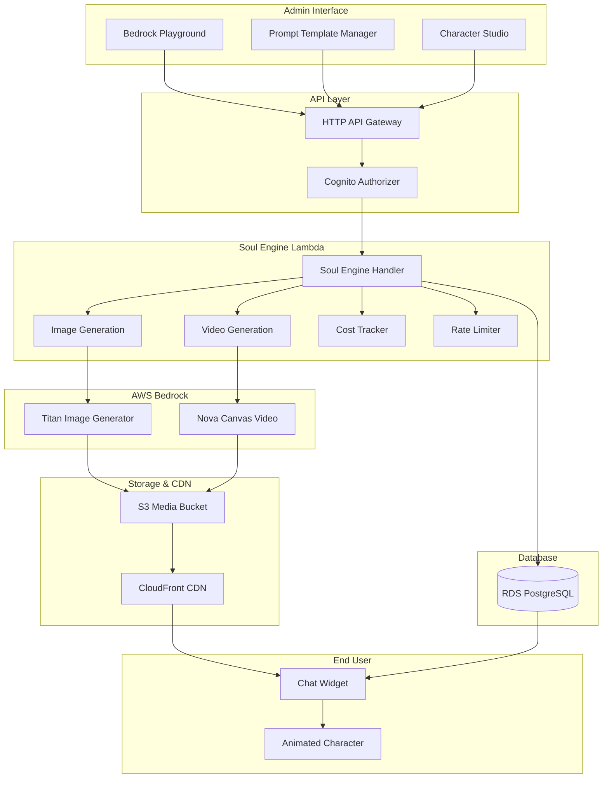
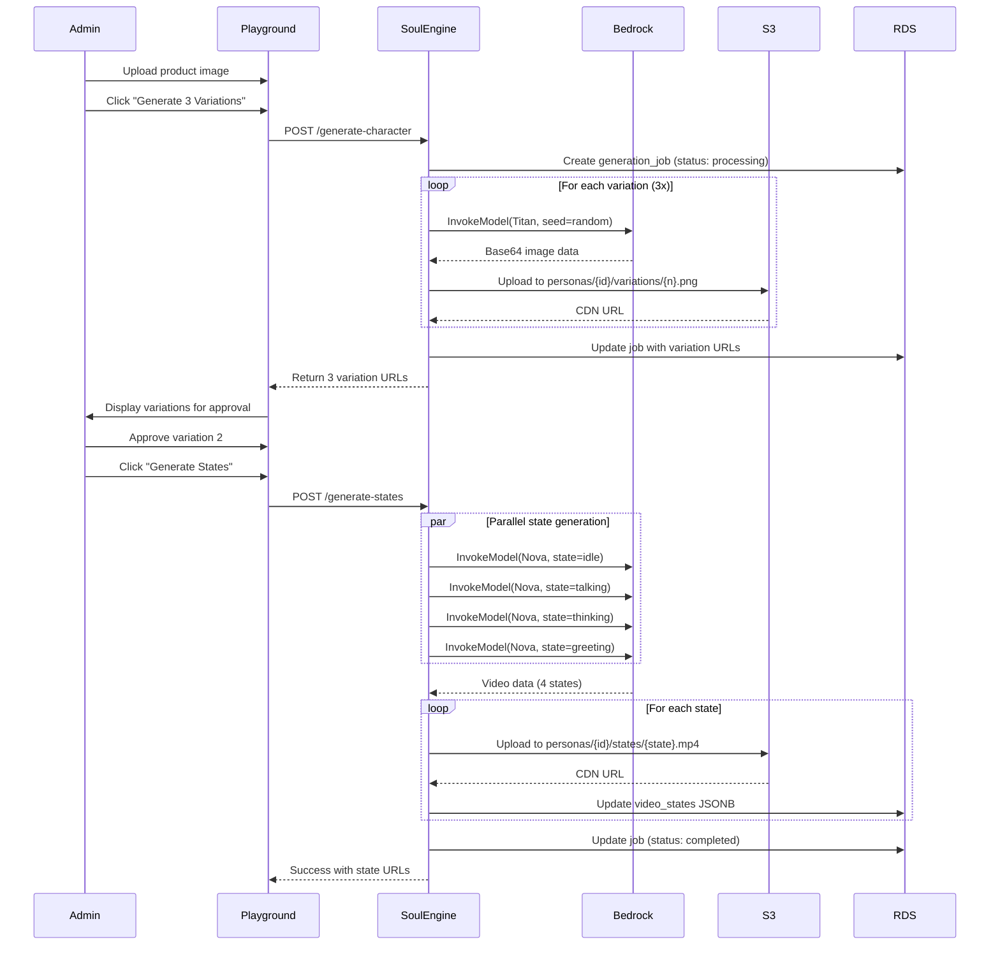
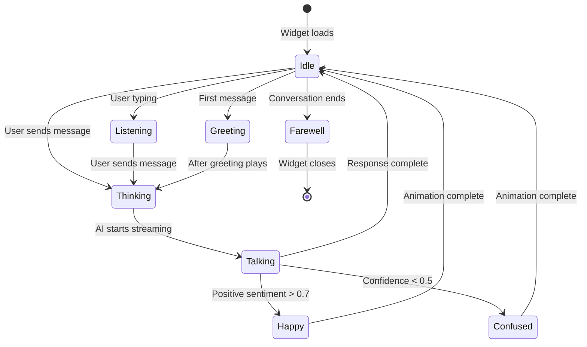

# Design Document: Bedrock Integration & Multi-State Animations

## Overview

This design implements AWS Bedrock integration for automated character generation and multi-state video animations in Toolstoy. The system transforms e-commerce product images into AI-powered animated characters with multiple emotional and conversational states, creating a living character experience for end users.

The design consists of three major components:

1. **Soul Engine Lambda**: Orchestrates character generation workflows, invoking Amazon Titan Image Generator for character images and Amazon Nova Canvas for state-based video animations
2. **Infrastructure Layer**: S3 storage with CloudFront CDN for global media delivery, database schema updates for video state tracking, and IAM policies for secure service access
3. **Widget Frontend**: Character-aware UI with three position states, dynamic color theming, special capabilities dock, and smooth animation state transitions

The system supports tiered animation states based on subscription level (Free: 4 states, Pro: 8 states, Enterprise: 12 states) and implements comprehensive error handling, cost tracking, and rate limiting to ensure reliable and cost-effective operation.

## Architecture

### System Architecture Diagram



### Data Flow: Character Generation




### Widget State Transition Flow



## Components and Interfaces

### Soul Engine Lambda

The Soul Engine is an AWS Lambda function that orchestrates all character generation workflows. It serves as the central coordinator between the admin interfaces, AWS Bedrock services, storage infrastructure, and database.

**Configuration:**
- Runtime: Node.js 20.x
- Memory: 3008 MB (required for video processing)
- Timeout: 300 seconds (5 minutes)
- Ephemeral Storage: 3072 MB
- Environment Variables:
  - `VIDEO_MODEL`: "nova-canvas"
  - `VIDEO_DURATION`: "6"
  - `VIDEO_FPS`: "24"
  - `S3_BUCKET`: "toolstoy-character-images"
  - `CDN_DOMAIN`: "cdn.toolstoy.app"
  - `DATABASE_URL`: Connection string from Amplify

**Handler Structure:**
```typescript
interface GenerateCharacterRequest {
  productImage: string; // Base64 or S3 URL
  productName: string;
  brandName?: string;
  characterType: string;
  vibeTags: string[];
  merchantId: string;
  subscriptionTier: 'free' | 'pro' | 'enterprise';
}

interface GenerateCharacterResponse {
  jobId: string;
  variations: Array<{
    id: string;
    url: string;
    seed: number;
  }>;
}

interface GenerateStatesRequest {
  personaId: string;
  approvedImageUrl: string;
  subscriptionTier: 'free' | 'pro' | 'enterprise';
}

interface GenerateStatesResponse {
  jobId: string;
  states: Record<string, string>; // state name -> CDN URL
  totalCost: number;
}
```


**Core Functions:**

1. **generateCharacterVariations()**
   - Retrieves active prompt template from database
   - Analyzes product image for dominant colors and category
   - Replaces template variables with product data
   - Invokes Titan Image Generator 3 times with different random seeds
   - Uploads variations to S3 at `personas/{persona-id}/variations/{1-3}.png`
   - Returns variation URLs and metadata

2. **generateStateVideos()**
   - Determines state count based on subscription tier
   - Generates state-specific motion prompts
   - Invokes Nova Canvas in parallel using Promise.all
   - Uploads videos to S3 at `personas/{persona-id}/states/{state-name}.mp4`
   - Updates persona.video_states JSONB column
   - Tracks progress in generation_jobs table

3. **trackCost()**
   - Calculates generation costs (Titan: $0.008/image, Nova: $0.05/video)
   - Stores cost in generation_jobs.cost_usd
   - Logs to CloudWatch for monthly aggregation

4. **enforceRateLimit()**
   - Checks generation count per merchant per hour
   - Returns 429 with retry-after if limit exceeded (10/hour)
   - Uses DynamoDB or in-memory cache for rate tracking

5. **handleRetry()**
   - Implements exponential backoff for Bedrock throttling
   - Retries failed generations up to 3 times
   - Logs errors with context for debugging

### Bedrock Service Integration

**Titan Image Generator (amazon.titan-image-generator-v1)**

Request format:
```json
{
  "taskType": "TEXT_IMAGE",
  "textToImageParams": {
    "text": "Friendly robot mascot character...",
    "negativeText": "blurry, low quality, distorted"
  },
  "imageGenerationConfig": {
    "numberOfImages": 1,
    "quality": "premium",
    "height": 1024,
    "width": 1024,
    "cfgScale": 8.0,
    "seed": 123456
  }
}
```

Response format:
```json
{
  "images": ["base64EncodedImageData..."]
}
```

**Nova Canvas (amazon.nova-canvas-v1:0)**

Request format:
```json
{
  "taskType": "IMAGE_TO_VIDEO",
  "imageToVideoParams": {
    "images": [{
      "format": "png",
      "source": {
        "bytes": "base64EncodedImageData..."
      }
    }],
    "text": "Gentle breathing, minimal movement, calm and peaceful"
  },
  "videoGenerationConfig": {
    "durationSeconds": 6,
    "fps": 24,
    "dimension": "1280x720",
    "seed": 123456
  }
}
```

Response format:
```json
{
  "video": "base64EncodedVideoData..."
}
```


### API Endpoints

**POST /api/bedrock/generate-character**

Generates 3 character image variations from product image.

Request:
```typescript
{
  productImage: string; // Base64 or S3 URL
  productName: string;
  brandName?: string;
  characterType: 'mascot' | 'spokesperson' | 'sidekick' | 'expert';
  vibeTags: string[];
  merchantId: string;
}
```

Response:
```typescript
{
  jobId: string;
  variations: Array<{
    id: string;
    url: string; // CDN URL
    seed: number;
    generatedAt: string;
  }>;
  estimatedCost: number;
}
```

**POST /api/bedrock/generate-states**

Generates animation state videos for approved character.

Request:
```typescript
{
  personaId: string;
  approvedImageUrl: string;
  subscriptionTier: 'free' | 'pro' | 'enterprise';
}
```

Response:
```typescript
{
  jobId: string;
  states: Record<string, string>; // state name -> CDN URL
  totalCost: number;
  estimatedTime: string; // "3-5 minutes"
}
```

**GET /api/bedrock/job-status/:jobId**

Polls generation job progress.

Response:
```typescript
{
  jobId: string;
  status: 'queued' | 'processing' | 'completed' | 'failed';
  currentStep: string; // "Generating idle animation"
  statesGenerated: string[]; // ["idle", "talking"]
  totalStates: number;
  errorMessage?: string;
  completedAt?: string;
}
```

**POST /api/bedrock/approve-variation**

Marks a variation as approved and sets as primary character image.

Request:
```typescript
{
  personaId: string;
  variationId: string;
}
```

Response:
```typescript
{
  success: boolean;
  imageUrl: string; // CDN URL of approved image
}
```


### Prompt Template System

The Prompt Template Manager allows admins to create master templates with variable placeholders that apply to all character generations.

**Template Variables:**
- `{PRODUCT_NAME}`: Extracted from user input
- `{PRODUCT_TYPE}`: Detected from image analysis (electronics, beauty, sports, food, fashion)
- `{PRODUCT_COLORS}`: Dominant colors extracted from product image
- `{CHARACTER_TYPE}`: User-selected character archetype
- `{VIBE_TAGS}`: User-selected personality tags

**Example Template:**
```
A friendly {CHARACTER_TYPE} character representing {PRODUCT_NAME}, 
a {PRODUCT_TYPE} product. The character embodies {VIBE_TAGS} personality 
with colors inspired by {PRODUCT_COLORS}. Professional 3D illustration style, 
standing on white background, full body visible, expressive face, 
high quality render, studio lighting.
```

**Database Schema:**
```sql
CREATE TABLE prompt_templates (
  id UUID PRIMARY KEY DEFAULT gen_random_uuid(),
  name VARCHAR(255) NOT NULL,
  template TEXT NOT NULL,
  is_active BOOLEAN DEFAULT false,
  created_by UUID REFERENCES merchants(id),
  created_at TIMESTAMP DEFAULT NOW(),
  updated_at TIMESTAMP DEFAULT NOW(),
  CONSTRAINT only_one_active UNIQUE (is_active) WHERE is_active = true
);
```

**Template Processing Flow:**
1. Retrieve active template from database
2. Analyze product image using image analysis library (sharp, jimp)
3. Extract dominant colors (top 3 hex values)
4. Detect product category from visual features
5. Replace all template variables with actual values
6. Append negative prompt: "blurry, low quality, distorted, deformed, text, watermark"
7. Send final prompt to Bedrock

### Animation State Definitions

**State Configuration:**
```typescript
interface AnimationState {
  id: string;
  name: string;
  motionPrompt: string;
  tier: 'free' | 'pro' | 'enterprise';
  triggerConditions: string[];
}

const ANIMATION_STATES: AnimationState[] = [
  // Free tier (4 states)
  {
    id: 'idle',
    name: 'Idle',
    motionPrompt: 'Gentle breathing, minimal movement, calm and peaceful, subtle sway',
    tier: 'free',
    triggerConditions: ['no_activity', 'default']
  },
  {
    id: 'talking',
    name: 'Talking',
    motionPrompt: 'Animated speaking, mouth moving expressively, hand gestures, engaged',
    tier: 'free',
    triggerConditions: ['ai_streaming_response']
  },
  {
    id: 'thinking',
    name: 'Thinking',
    motionPrompt: 'Pondering, looking up thoughtfully, hand on chin, contemplative',
    tier: 'free',
    triggerConditions: ['ai_generating_response']
  },
  {
    id: 'greeting',
    name: 'Greeting',
    motionPrompt: 'Waving hand, friendly smile, welcoming gesture, warm approach',
    tier: 'free',
    triggerConditions: ['first_message']
  },
  
  // Pro tier (additional 4 states)
  {
    id: 'happy',
    name: 'Happy',
    motionPrompt: 'Jumping with joy, big smile, enthusiastic, celebratory movement',
    tier: 'pro',
    triggerConditions: ['positive_sentiment > 0.7']
  },
  {
    id: 'confused',
    name: 'Confused',
    motionPrompt: 'Head tilt, scratching head, puzzled expression, uncertain gesture',
    tier: 'pro',
    triggerConditions: ['confidence < 0.5']
  },
  {
    id: 'excited',
    name: 'Excited',
    motionPrompt: 'Energetic movement, arms raised, celebration, dynamic pose',
    tier: 'pro',
    triggerConditions: ['high_engagement']
  },
  {
    id: 'listening',
    name: 'Listening',
    motionPrompt: 'Nodding, attentive, focused gaze, leaning forward slightly',
    tier: 'pro',
    triggerConditions: ['user_typing']
  },
  
  // Enterprise tier (additional 4 states)
  {
    id: 'sad',
    name: 'Sad',
    motionPrompt: 'Downcast expression, slumped posture, empathetic, gentle movement',
    tier: 'enterprise',
    triggerConditions: ['negative_sentiment > 0.7']
  },
  {
    id: 'surprised',
    name: 'Surprised',
    motionPrompt: 'Eyes wide, mouth open, sudden movement, startled reaction',
    tier: 'enterprise',
    triggerConditions: ['unexpected_input']
  },
  {
    id: 'confident',
    name: 'Confident',
    motionPrompt: 'Chest out, strong posture, assured gesture, commanding presence',
    tier: 'enterprise',
    triggerConditions: ['high_confidence > 0.9']
  },
  {
    id: 'farewell',
    name: 'Farewell',
    motionPrompt: 'Waving goodbye, warm smile, departing gesture, friendly exit',
    tier: 'enterprise',
    triggerConditions: ['conversation_end']
  }
];
```


## Data Models

### Database Schema Updates

**personas table additions:**
```sql
ALTER TABLE personas 
ADD COLUMN video_states JSONB DEFAULT '{}',
ADD COLUMN approved_variation_id VARCHAR(255),
ADD COLUMN generation_metadata JSONB DEFAULT '{}';

-- Example video_states structure:
-- {
--   "idle": "https://cdn.toolstoy.app/personas/abc-123/states/idle.mp4",
--   "talking": "https://cdn.toolstoy.app/personas/abc-123/states/talking.mp4",
--   "thinking": "https://cdn.toolstoy.app/personas/abc-123/states/thinking.mp4",
--   "greeting": "https://cdn.toolstoy.app/personas/abc-123/states/greeting.mp4"
-- }
```

**generation_jobs table:**
```sql
CREATE TABLE generation_jobs (
  id UUID PRIMARY KEY DEFAULT gen_random_uuid(),
  persona_id UUID REFERENCES personas(id),
  merchant_id UUID REFERENCES merchants(id),
  job_type VARCHAR(50) NOT NULL, -- 'image' or 'video'
  status VARCHAR(50) DEFAULT 'queued', -- queued, processing, completed, failed
  current_step VARCHAR(255),
  states_generated TEXT[] DEFAULT '{}',
  total_states INTEGER DEFAULT 0,
  cost_usd DECIMAL(10, 4) DEFAULT 0,
  error_message TEXT,
  error_code VARCHAR(100),
  retry_count INTEGER DEFAULT 0,
  metadata JSONB DEFAULT '{}',
  started_at TIMESTAMP,
  completed_at TIMESTAMP,
  created_at TIMESTAMP DEFAULT NOW()
);

CREATE INDEX idx_generation_jobs_persona ON generation_jobs(persona_id);
CREATE INDEX idx_generation_jobs_merchant ON generation_jobs(merchant_id);
CREATE INDEX idx_generation_jobs_status ON generation_jobs(status);
```

**prompt_templates table:**
```sql
CREATE TABLE prompt_templates (
  id UUID PRIMARY KEY DEFAULT gen_random_uuid(),
  name VARCHAR(255) NOT NULL,
  template TEXT NOT NULL,
  description TEXT,
  is_active BOOLEAN DEFAULT false,
  variables TEXT[] DEFAULT '{}', -- Extracted variable names
  created_by UUID REFERENCES merchants(id),
  created_at TIMESTAMP DEFAULT NOW(),
  updated_at TIMESTAMP DEFAULT NOW(),
  CONSTRAINT only_one_active UNIQUE (is_active) WHERE is_active = true
);

CREATE INDEX idx_prompt_templates_active ON prompt_templates(is_active);
```

**character_variations table:**
```sql
CREATE TABLE character_variations (
  id UUID PRIMARY KEY DEFAULT gen_random_uuid(),
  persona_id UUID REFERENCES personas(id),
  generation_job_id UUID REFERENCES generation_jobs(id),
  variation_number INTEGER NOT NULL, -- 1, 2, or 3
  image_url VARCHAR(500) NOT NULL,
  seed INTEGER NOT NULL,
  is_approved BOOLEAN DEFAULT false,
  created_at TIMESTAMP DEFAULT NOW()
);

CREATE INDEX idx_character_variations_persona ON character_variations(persona_id);
CREATE INDEX idx_character_variations_approved ON character_variations(is_approved);
```

### S3 Bucket Structure

**Bucket Name:** `toolstoy-character-images`

**Folder Structure:**
```
toolstoy-character-images/
├── personas/
│   ├── {persona-id}/
│   │   ├── avatar.png                    # Final approved character image
│   │   ├── variations/
│   │   │   ├── 1.png                     # Variation 1
│   │   │   ├── 2.png                     # Variation 2
│   │   │   └── 3.png                     # Variation 3
│   │   └── states/
│   │       ├── idle.mp4                  # Idle animation
│   │       ├── talking.mp4               # Talking animation
│   │       ├── thinking.mp4              # Thinking animation
│   │       ├── greeting.mp4              # Greeting animation
│   │       ├── happy.mp4                 # Happy animation (Pro+)
│   │       ├── confused.mp4              # Confused animation (Pro+)
│   │       ├── excited.mp4               # Excited animation (Pro+)
│   │       ├── listening.mp4             # Listening animation (Pro+)
│   │       ├── sad.mp4                   # Sad animation (Enterprise)
│   │       ├── surprised.mp4             # Surprised animation (Enterprise)
│   │       ├── confident.mp4             # Confident animation (Enterprise)
│   │       └── farewell.mp4              # Farewell animation (Enterprise)
```

**S3 Object Metadata:**
```typescript
{
  ContentType: 'image/png' | 'video/mp4',
  CacheControl: 'public, max-age=31536000', // 1 year
  Metadata: {
    personaId: string,
    generationJobId: string,
    seed: string,
    generatedAt: string
  }
}
```


### CloudFront CDN Configuration

**Distribution Settings:**
- Origin: `toolstoy-character-images.s3.us-east-1.amazonaws.com`
- Domain: `cdn.toolstoy.app`
- Price Class: All Edge Locations (best performance)
- Viewer Protocol Policy: Redirect HTTP to HTTPS
- Allowed HTTP Methods: GET, HEAD, OPTIONS
- Cache Policy: CachingOptimized
- Origin Request Policy: CORS-S3Origin

**Cache Behavior:**
```json
{
  "PathPattern": "personas/*",
  "TargetOriginId": "S3-toolstoy-character-images",
  "ViewerProtocolPolicy": "redirect-to-https",
  "AllowedMethods": ["GET", "HEAD", "OPTIONS"],
  "CachedMethods": ["GET", "HEAD"],
  "Compress": true,
  "DefaultTTL": 31536000,
  "MaxTTL": 31536000,
  "MinTTL": 0
}
```

**CORS Configuration:**
```json
{
  "CORSRules": [{
    "AllowedOrigins": ["*"],
    "AllowedMethods": ["GET", "HEAD"],
    "AllowedHeaders": ["*"],
    "MaxAgeSeconds": 3600
  }]
}
```

### Widget Data Models

**Character Configuration:**
```typescript
interface CharacterConfig {
  id: string;
  name: string;
  imageUrl: string;
  videoStates: Record<string, string>; // state name -> CDN URL
  dominantColor: string; // Hex color
  capabilities: CapabilityManifest;
  subscriptionTier: 'free' | 'pro' | 'enterprise';
}

interface CapabilityManifest {
  visual?: {
    rotate3D?: boolean;
    showImage?: boolean;
    animation?: boolean;
  };
  audio?: {
    voiceControl?: boolean;
    soundEffects?: boolean;
    ambientMusic?: boolean;
  };
  spatial?: {
    positionControl?: boolean;
    resizeControl?: boolean;
    minimizeOption?: boolean;
  };
}
```

**Widget State:**
```typescript
interface WidgetState {
  isMinimized: boolean;
  positionState: 'intimate' | 'balanced' | 'ambient';
  currentAnimationState: string;
  characterColor: string;
  isVoiceEnabled: boolean;
  conversationActive: boolean;
}
```

**Animation State Trigger Logic:**
```typescript
interface StateTrigger {
  condition: string;
  targetState: string;
  priority: number; // Higher priority overrides lower
  duration?: number; // For one-time animations
}

const STATE_TRIGGERS: StateTrigger[] = [
  { condition: 'first_message', targetState: 'greeting', priority: 10, duration: 6000 },
  { condition: 'user_typing', targetState: 'listening', priority: 5 },
  { condition: 'ai_generating', targetState: 'thinking', priority: 7 },
  { condition: 'ai_streaming', targetState: 'talking', priority: 8 },
  { condition: 'positive_sentiment', targetState: 'happy', priority: 6, duration: 6000 },
  { condition: 'low_confidence', targetState: 'confused', priority: 6, duration: 6000 },
  { condition: 'conversation_end', targetState: 'farewell', priority: 9, duration: 6000 },
  { condition: 'default', targetState: 'idle', priority: 1 }
];
```


## Correctness Properties

*A property is a characteristic or behavior that should hold true across all valid executions of a system-essentially, a formal statement about what the system should do. Properties serve as the bridge between human-readable specifications and machine-verifiable correctness guarantees.*

### Property Reflection

After analyzing all acceptance criteria, I identified the following redundancies and consolidations:

- **Properties 3.3, 3.4, 3.5** (tier-based state counts) can be combined into a single property that validates state count based on subscription tier
- **Properties 1.3, 3.8, 5.2** (S3 path structure) can be combined into a comprehensive path validation property
- **Properties 8.1, 8.2** (cost tracking) test the same cost calculation and storage behavior
- **Properties 7.3, 7.6** (template variable substitution) test the same prompt construction process
- **Properties 18.2, 18.3, 18.4** (position state configurations) can be combined into a single property validating all position states
- **Properties 23.2, 23.3, 23.4** (capability type support) can be combined into a single property validating all capability categories

The following properties provide unique validation value and will be included:

### Backend/Soul Engine Properties

### Property 1: Three Variations with Unique Seeds

*For any* character generation request, the Soul Engine should generate exactly 3 image variations, each with a unique random seed value.

**Validates: Requirements 1.1**

### Property 2: Image Resolution and Quality

*For any* generated character image, the resolution should be exactly 1024x1024 pixels and the quality setting should be "premium" in the Bedrock API request.

**Validates: Requirements 1.2**

### Property 3: S3 Path Structure Consistency

*For any* uploaded media asset (image or video), the S3 path should follow the pattern `personas/{persona-id}/variations/{n}.png` for variations, `personas/{persona-id}/avatar.png` for approved images, and `personas/{persona-id}/states/{state-name}.mp4` for state videos.

**Validates: Requirements 1.3, 3.8, 5.2**

### Property 4: Retry Logic with Exponential Backoff

*For any* failed Bedrock API call, the Soul Engine should retry up to 3 times with exponential backoff starting at 2 seconds (2s, 4s, 8s) before marking the operation as failed.

**Validates: Requirements 1.5, 9.1**

### Property 5: Generation Metadata Completeness

*For any* generation job record, the metadata should include seed number, timestamp, model ID, and cost for each generated asset.

**Validates: Requirements 1.6**

### Property 6: Approved Image Persistence

*For any* approved character variation, updating the persona record should set the image_url to the approved variation's CDN URL and set status to "active".

**Validates: Requirements 2.4**

### Property 7: Prompt Parameter Preservation on Regeneration

*For any* regeneration request, all prompt parameters (product name, character type, vibe tags) from the original request should be preserved in the new generation request.

**Validates: Requirements 2.5**


### Property 8: Consistent Base Image for All States

*For any* set of state video generations, all videos should use the same approved base image as the first frame to ensure visual consistency across all animation states.

**Validates: Requirements 3.1, 3.2**

### Property 9: Tier-Based State Count

*For any* character generation, the number of animation states generated should match the subscription tier: 4 states for Free (idle, talking, thinking, greeting), 8 states for Pro (Free + happy, confused, excited, listening), and 12 states for Enterprise (Pro + sad, surprised, confident, farewell).

**Validates: Requirements 3.3, 3.4, 3.5**

### Property 10: State-Specific Motion Prompts

*For any* animation state video generation, the motion prompt should be unique to that state (e.g., "gentle breathing" for idle, "animated speaking" for talking) and different from all other state prompts.

**Validates: Requirements 3.6**

### Property 11: Video Configuration Parameters

*For any* state video generation request, the configuration should specify exactly 6 seconds duration, 24 fps, and 1280x720 resolution.

**Validates: Requirements 3.7**

### Property 12: Video States JSONB Structure

*For any* persona record with generated videos, the video_states JSONB column should contain key-value pairs where keys are state names (strings) and values are CDN URLs (strings starting with "https://cdn.toolstoy.app/").

**Validates: Requirements 3.9, 13.2**

### Property 13: Progress Tracking Updates

*For any* generation job, the states_generated array should grow incrementally with each completed state, and total_states should equal the expected count for the subscription tier.

**Validates: Requirements 3.10, 11.3**

### Property 14: Parallel Video Generation

*For any* multi-state video generation, all state videos should be generated concurrently (not sequentially), verifiable by overlapping generation timestamps.

**Validates: Requirements 4.1**

### Property 15: Independent State Retry

*For any* failed state video generation, retrying that specific state should not block or affect the generation of other states in the same job.

**Validates: Requirements 4.5**

### Property 16: Incremental Progress Updates

*For any* generation job in "processing" status, the current_step field should be updated after each major operation (variation generation, state completion) with descriptive text.

**Validates: Requirements 4.6, 11.2**

### Property 17: S3 Content-Type Metadata

*For any* uploaded media asset, the S3 object metadata should have ContentType set to "image/png" for PNG files and "video/mp4" for MP4 files.

**Validates: Requirements 5.6**

### Property 18: Active Template Retrieval

*For any* character generation request, the Soul Engine should retrieve the prompt template marked as is_active=true from the database.

**Validates: Requirements 7.2**

### Property 19: Complete Variable Substitution

*For any* prompt template with variables, all placeholders ({PRODUCT_NAME}, {PRODUCT_TYPE}, {PRODUCT_COLORS}, {CHARACTER_TYPE}, {VIBE_TAGS}) should be replaced with actual values in the final prompt sent to Bedrock.

**Validates: Requirements 7.3, 7.6**

### Property 20: Color Extraction from Product Image

*For any* uploaded product image, the Soul Engine should extract at least one dominant color in hex format (e.g., "#4F46E5") for use in template substitution.

**Validates: Requirements 7.4**

### Property 21: Product Category Detection

*For any* uploaded product image, the Soul Engine should assign a product category from the set: electronics, beauty, sports, food, fashion, or other.

**Validates: Requirements 7.5**

### Property 22: Single Active Template Enforcement

*For any* attempt to activate a new prompt template, all other templates should be automatically deactivated, ensuring only one template has is_active=true.

**Validates: Requirements 7.7, 7.8**

### Property 23: Cost Calculation and Storage

*For any* generation job, the cost_usd field should equal (number_of_images × $0.008) + (number_of_videos × $0.05) and be stored in the generation_jobs table.

**Validates: Requirements 8.1, 8.2**

### Property 24: Rate Limit Enforcement

*For any* merchant, the 11th character generation request within a 60-minute window should be rejected with a 429 status code and a retry-after timestamp.

**Validates: Requirements 8.3, 8.4**

### Property 25: Asset Caching Prevention

*For any* character with existing generated assets, editing character metadata (name, catchphrase, personality) should not trigger regeneration of images or videos.

**Validates: Requirements 8.5**

### Property 26: Regeneration Cooldown

*For any* character, manual regeneration requests should be rejected if less than 24 hours have passed since the last generation, returning an error with the remaining cooldown time.

**Validates: Requirements 8.6**

### Property 27: Cost Logging to CloudWatch

*For any* completed generation job, a CloudWatch log entry should be created containing the job ID, merchant ID, cost_usd, and timestamp for cost tracking.

**Validates: Requirements 8.7**

### Property 28: Throttling Exception Retry

*For any* Bedrock ThrottlingException, the Soul Engine should retry with exponential backoff delays of 2s, 4s, 8s before failing.

**Validates: Requirements 9.1**

### Property 29: Validation Exception Handling

*For any* Bedrock ValidationException, the Soul Engine should log the full prompt details and return a user-friendly error message without exposing internal details.

**Validates: Requirements 9.2**

### Property 30: Service Unavailable Handling

*For any* Bedrock ServiceUnavailableException, the generation job status should be set to "failed" with error_message indicating the service is temporarily unavailable.

**Validates: Requirements 9.3**

### Property 31: Placeholder Image Fallback

*For any* image generation that fails after 3 retries, the persona image_url should be set to a default placeholder image URL matching the character type.

**Validates: Requirements 9.4**

### Property 32: Partial Video Generation Success

*For any* multi-state video generation where some states fail, the video_states JSONB should contain URLs for successful states and null or error markers for failed states.

**Validates: Requirements 9.5**

### Property 33: Error Details Storage

*For any* failed generation job, the generation_jobs record should have both error_message (user-friendly) and error_code (technical) fields populated.

**Validates: Requirements 9.6**

### Property 34: Job Creation with Processing Status

*For any* new generation request, a generation_jobs record should be created with status="processing" before any Bedrock API calls are made.

**Validates: Requirements 11.1**


### Widget/Frontend Properties

### Property 35: State Transition Based on AI Activity

*For any* widget state, when the AI starts generating a response, the animation state should transition to "thinking", and when the AI starts streaming a response, it should transition to "talking".

**Validates: Requirements 6.2, 6.3**

### Property 36: Conditional State Availability

*For any* animation state transition request, if the requested state is not available in the current subscription tier, the widget should fall back to the "idle" state.

**Validates: Requirements 6.4, 6.10**

### Property 37: One-Time Animation Sequence

*For any* one-time animation state (greeting, farewell), the widget should play the animation once for its full duration (6 seconds), then automatically return to the "idle" state.

**Validates: Requirements 6.5, 6.8**

### Property 38: Sentiment-Based State Transition

*For any* AI response with a sentiment score above 0.7, the widget should transition to the "happy" state (if available), and for confidence scores below 0.5, it should transition to "confused" (if available).

**Validates: Requirements 6.6, 6.7**

### Property 39: Video Preloading

*For any* widget initialization, all available state videos for the current subscription tier should be preloaded before the first user interaction.

**Validates: Requirements 6.9**

### Property 40: Character Color Extraction

*For any* character loaded in the widget, a dominant color should be extracted from the character image or metadata and stored in the CSS custom property `--character-primary`.

**Validates: Requirements 16.1, 16.4**

### Property 41: Color Mix Percentage Range

*For any* UI element using character color, the color-mix() function should use between 3% and 15% of the character color mixed with white or gray.

**Validates: Requirements 16.2**

### Property 42: Color Application to UI Elements

*For any* character color change, the background, borders, message bubbles, and hover states should all update to use the new character color within 400ms.

**Validates: Requirements 16.3, 16.5**

### Property 43: Position State Configuration

*For any* position state, the character scale and chat width should match the specification: intimate (100% scale, 70% width), balanced (80% scale, 50% width), ambient (40% scale, 30% width).

**Validates: Requirements 18.2, 18.3, 18.4**

### Property 44: Position State Transition Timing

*For any* position state change, the transition animation should complete in exactly 400ms using the specified easing function.

**Validates: Requirements 18.6**

### Property 45: Position Preference Persistence

*For any* position state change, the user's selection should be saved to localStorage and restored on the next widget load.

**Validates: Requirements 18.7**

### Property 46: Capability Manifest Reading

*For any* character with a capabilities manifest, the widget should parse the manifest and enable only the features declared in visual, audio, and spatial properties.

**Validates: Requirements 20.1, 23.1**

### Property 47: Conditional Dock Display

*For any* character, the Special Needs Dock should be displayed only when the capabilities manifest contains at least one capability in visual, audio, or spatial categories.

**Validates: Requirements 20.2**

### Property 48: Capability Type Support

*For any* capability manifest, the widget should recognize and handle all capability types: rotate3D, showImage, playVideo, animation, audioClip, arMode (visual); voiceControl, soundEffects, ambientMusic (audio); positionControl, resizeControl, minimizeOption (spatial).

**Validates: Requirements 20.6, 23.2, 23.3, 23.4**

### Property 49: Capability Manifest Validation

*For any* character load, if the capabilities manifest is malformed or contains invalid capability types, the widget should log a validation error and continue with an empty capabilities object.

**Validates: Requirements 23.5**

### Property 50: Control Visibility Based on Capabilities

*For any* capability not declared in the manifest, the corresponding control button should not be rendered in the widget UI.

**Validates: Requirements 23.6**

### Property 51: Minimized State Scale

*For any* widget in minimized state, the character should be displayed at 40% of the original size with 50% desaturation and a breathing animation (0.5% scale pulse every 4 seconds).

**Validates: Requirements 21.1, 21.2, 21.3**

### Property 52: Animation Timing Consistency

*For any* animation or transition, the duration should match the specification: 400ms for major state changes (position, minimize, color theme), 200ms for micro-interactions (hover, control activation), 300ms for message bubble hover effects.

**Validates: Requirements 24.1, 24.2, 24.3**

### Property 53: Default Widget Dimensions

*For any* widget initialization without custom dimensions, the default size should be 480px width × 640px height.

**Validates: Requirements 25.1**

### Property 54: CSS Custom Property Support

*For any* widget with CSS custom properties `--chat-width` and `--chat-height` defined, the widget dimensions should respect these values instead of the defaults.

**Validates: Requirements 25.2**

### Property 55: Responsive Position State Adaptation

*For any* screen width below 768px, the position state widths should adapt to mobile values: intimate (90%), balanced (80%), ambient (60%).

**Validates: Requirements 25.3**

### Property 56: Responsive Border Radius

*For any* screen width below 768px, the widget border radius should reduce from 32px to 24px.

**Validates: Requirements 25.4**

### Property 57: Aspect Ratio Preservation

*For any* widget resize operation, the aspect ratio (width:height) should remain constant at 3:4 (480:640).

**Validates: Requirements 25.6**


## Error Handling

### Error Categories and Responses

**1. Bedrock Service Errors**

| Error Type | Error Code | Handling Strategy | User Message |
|------------|------------|-------------------|--------------|
| ThrottlingException | BEDROCK_THROTTLED | Retry with exponential backoff (2s, 4s, 8s) | "Service is busy. Retrying automatically..." |
| ValidationException | BEDROCK_INVALID_PROMPT | Log prompt details, return error | "Invalid prompt configuration. Please contact support." |
| ServiceUnavailableException | BEDROCK_UNAVAILABLE | Mark job as failed, notify user | "AI service temporarily unavailable. Please try again in a few minutes." |
| ModelNotFoundException | BEDROCK_MODEL_NOT_FOUND | Check model access, return error | "AI model not configured. Please contact administrator." |
| AccessDeniedException | BEDROCK_ACCESS_DENIED | Log IAM issue, return error | "Service access error. Please contact support." |

**2. Rate Limiting Errors**

| Condition | Error Code | Response | User Message |
|-----------|------------|----------|--------------|
| > 10 generations/hour | RATE_LIMIT_EXCEEDED | 429 status with retry-after | "Generation limit reached. Try again in {minutes} minutes." |
| < 24h since last regen | COOLDOWN_ACTIVE | 403 status with remaining time | "Regeneration available in {hours} hours." |

**3. Storage Errors**

| Error Type | Error Code | Handling Strategy | User Message |
|------------|------------|-------------------|--------------|
| S3 Upload Failed | S3_UPLOAD_ERROR | Retry 3 times, then fail | "Failed to save media. Please try again." |
| S3 Access Denied | S3_ACCESS_ERROR | Log IAM issue, return error | "Storage access error. Please contact support." |
| CDN Propagation Delay | CDN_NOT_READY | Return URL immediately, CDN will cache on first request | "Media uploaded successfully." |

**4. Database Errors**

| Error Type | Error Code | Handling Strategy | User Message |
|------------|------------|-------------------|--------------|
| Connection Failed | DB_CONNECTION_ERROR | Retry with backoff, then fail | "Database temporarily unavailable. Please try again." |
| Constraint Violation | DB_CONSTRAINT_ERROR | Return specific constraint error | "Invalid data. Please check your input." |
| Query Timeout | DB_TIMEOUT | Retry once, then fail | "Operation timed out. Please try again." |

**5. Validation Errors**

| Condition | Error Code | Response | User Message |
|-----------|------------|----------|--------------|
| Missing product image | MISSING_IMAGE | 400 status | "Please upload a product image." |
| Invalid character type | INVALID_CHARACTER_TYPE | 400 status | "Invalid character type selected." |
| Empty prompt template | EMPTY_TEMPLATE | 400 status | "Prompt template cannot be empty." |
| Invalid subscription tier | INVALID_TIER | 400 status | "Invalid subscription tier." |

### Error Recovery Strategies

**Retry Logic:**
```typescript
async function retryWithBackoff<T>(
  operation: () => Promise<T>,
  maxRetries: number = 3,
  baseDelay: number = 2000
): Promise<T> {
  for (let attempt = 0; attempt < maxRetries; attempt++) {
    try {
      return await operation();
    } catch (error) {
      if (attempt === maxRetries - 1) throw error;
      
      const delay = baseDelay * Math.pow(2, attempt);
      await new Promise(resolve => setTimeout(resolve, delay));
    }
  }
  throw new Error('Max retries exceeded');
}
```

**Partial Failure Handling:**
```typescript
async function generateStatesWithPartialSuccess(
  states: string[],
  baseImage: string
): Promise<{ success: Record<string, string>, failed: string[] }> {
  const results = await Promise.allSettled(
    states.map(state => generateStateVideo(state, baseImage))
  );
  
  const success: Record<string, string> = {};
  const failed: string[] = [];
  
  results.forEach((result, index) => {
    if (result.status === 'fulfilled') {
      success[states[index]] = result.value;
    } else {
      failed.push(states[index]);
    }
  });
  
  return { success, failed };
}
```

**Fallback Strategies:**
- Use placeholder images when generation fails after max retries
- Fall back to idle state when requested animation state is unavailable
- Use default prompt template if active template retrieval fails
- Continue with partial video states if some generations fail


## Testing Strategy

### Dual Testing Approach

This feature requires both unit testing and property-based testing for comprehensive coverage:

- **Unit tests**: Verify specific examples, edge cases, error conditions, and UI interactions
- **Property tests**: Verify universal properties across all inputs using randomized test data

Together, these approaches ensure both concrete bug detection and general correctness validation.

### Property-Based Testing Configuration

**Library Selection:**
- **Backend (Node.js)**: Use `fast-check` for property-based testing
- **Frontend (TypeScript/React)**: Use `fast-check` with React Testing Library

**Test Configuration:**
- Minimum 100 iterations per property test (due to randomization)
- Each property test must reference its design document property
- Tag format: `Feature: bedrock-integration-multi-state-animations, Property {number}: {property_text}`

**Example Property Test:**
```typescript
import fc from 'fast-check';

// Feature: bedrock-integration-multi-state-animations, Property 1: Three Variations with Unique Seeds
test('generates exactly 3 variations with unique seeds', async () => {
  await fc.assert(
    fc.asyncProperty(
      fc.record({
        productImage: fc.webUrl(),
        productName: fc.string({ minLength: 1, maxLength: 100 }),
        characterType: fc.constantFrom('mascot', 'spokesperson', 'sidekick', 'expert'),
        vibeTags: fc.array(fc.string(), { minLength: 1, maxLength: 5 })
      }),
      async (request) => {
        const result = await generateCharacterVariations(request);
        
        // Should have exactly 3 variations
        expect(result.variations).toHaveLength(3);
        
        // All seeds should be unique
        const seeds = result.variations.map(v => v.seed);
        const uniqueSeeds = new Set(seeds);
        expect(uniqueSeeds.size).toBe(3);
      }
    ),
    { numRuns: 100 }
  );
});
```

### Unit Testing Strategy

**Backend Unit Tests:**

1. **Soul Engine Lambda Tests**
   - Test image generation with mock Bedrock responses
   - Test video generation with mock Bedrock responses
   - Test S3 upload with mock AWS SDK
   - Test database operations with mock queries
   - Test error handling for each error type
   - Test retry logic with simulated failures
   - Test cost calculation with various tier combinations
   - Test rate limiting with time-based scenarios

2. **Prompt Template Tests**
   - Test template variable extraction
   - Test variable substitution with various inputs
   - Test color extraction from sample images
   - Test category detection from sample images
   - Test active template enforcement

3. **API Endpoint Tests**
   - Test request validation
   - Test authentication and authorization
   - Test response format
   - Test error responses

**Frontend Unit Tests:**

1. **Widget Component Tests**
   - Test character loading and initialization
   - Test state transitions based on triggers
   - Test color extraction and application
   - Test position state changes
   - Test capability manifest parsing
   - Test Special Needs Dock rendering
   - Test localStorage persistence
   - Test responsive behavior

2. **Bedrock Playground Tests**
   - Test variation display
   - Test approval workflow
   - Test regeneration
   - Test error display

3. **Character Studio Tests**
   - Test image upload
   - Test generation request
   - Test progress polling
   - Test success/error states

### Integration Testing

**End-to-End Workflows:**

1. **Complete Character Generation Flow**
   - Upload product image → Generate variations → Approve variation → Generate states → Verify all assets in S3 and database

2. **Widget State Transition Flow**
   - Load widget → Send message → Verify thinking state → Verify talking state → Verify return to idle

3. **Error Recovery Flow**
   - Trigger Bedrock throttling → Verify retry → Verify eventual success or proper failure

4. **Rate Limiting Flow**
   - Generate 10 characters → Verify 11th is rejected → Wait for cooldown → Verify success

### Test Data Generators

**Property Test Generators:**

```typescript
// Character generation request generator
const characterRequestArb = fc.record({
  productImage: fc.webUrl(),
  productName: fc.string({ minLength: 1, maxLength: 100 }),
  brandName: fc.option(fc.string({ minLength: 1, maxLength: 100 })),
  characterType: fc.constantFrom('mascot', 'spokesperson', 'sidekick', 'expert'),
  vibeTags: fc.array(
    fc.constantFrom('friendly', 'professional', 'playful', 'energetic', 'calm'),
    { minLength: 1, maxLength: 5 }
  ),
  merchantId: fc.uuid(),
  subscriptionTier: fc.constantFrom('free', 'pro', 'enterprise')
});

// Animation state generator
const animationStateArb = fc.constantFrom(
  'idle', 'talking', 'thinking', 'greeting',
  'happy', 'confused', 'excited', 'listening',
  'sad', 'surprised', 'confident', 'farewell'
);

// Capability manifest generator
const capabilityManifestArb = fc.record({
  visual: fc.option(fc.record({
    rotate3D: fc.boolean(),
    showImage: fc.boolean(),
    animation: fc.boolean()
  })),
  audio: fc.option(fc.record({
    voiceControl: fc.boolean(),
    soundEffects: fc.boolean(),
    ambientMusic: fc.boolean()
  })),
  spatial: fc.option(fc.record({
    positionControl: fc.boolean(),
    resizeControl: fc.boolean(),
    minimizeOption: fc.boolean()
  }))
});

// Sentiment score generator (0.0 to 1.0)
const sentimentScoreArb = fc.double({ min: 0, max: 1 });

// Position state generator
const positionStateArb = fc.constantFrom('intimate', 'balanced', 'ambient');
```

### Performance Testing

**Load Testing Scenarios:**

1. **Concurrent Generation Requests**
   - Simulate 50 concurrent character generation requests
   - Verify all complete within acceptable time
   - Verify no resource exhaustion

2. **CDN Performance**
   - Measure first-byte time for media assets
   - Verify cache hit rates
   - Test global edge location performance

3. **Widget Load Time**
   - Measure time to first render
   - Measure video preload time
   - Verify smooth state transitions under load

**Performance Benchmarks:**
- Image generation: < 10 seconds per variation
- Video generation (4 states): < 5 minutes total
- Video generation (8 states): < 8 minutes total
- Video generation (12 states): < 12 minutes total
- Widget initialization: < 2 seconds
- State transition: < 100ms (instant to user)
- CDN first-byte time: < 200ms globally

### Test Coverage Goals

- **Backend Code Coverage**: > 80%
- **Frontend Code Coverage**: > 75%
- **Property Test Coverage**: All 57 properties implemented
- **Integration Test Coverage**: All critical user workflows
- **Error Scenario Coverage**: All error types in error handling table

### Continuous Testing

**Pre-Deployment Checks:**
1. All unit tests pass
2. All property tests pass (100 iterations each)
3. Integration tests pass
4. No TypeScript errors
5. No linting errors
6. Performance benchmarks met

**Post-Deployment Monitoring:**
1. CloudWatch logs for generation errors
2. Cost tracking alerts
3. Rate limit violations
4. CDN cache hit rates
5. Widget load time metrics
6. State transition performance


## Implementation Notes

### Phase 1: Infrastructure Setup

1. **AWS Bedrock Model Access**
   - Enable Titan Image Generator (amazon.titan-image-generator-v1) in AWS Console
   - Enable Nova Canvas (amazon.nova-canvas-v1:0) in AWS Console
   - Verify model access in us-east-1 region

2. **S3 Bucket Creation**
   - Create bucket: `toolstoy-character-images`
   - Enable versioning for asset recovery
   - Configure CORS for widget access
   - Set up lifecycle policies for cost optimization

3. **CloudFront Distribution**
   - Create distribution with S3 origin
   - Configure custom domain: `cdn.toolstoy.app`
   - Set up SSL certificate
   - Configure cache behaviors

4. **Database Schema Updates**
   - Run migration to add video_states JSONB column to personas table
   - Create generation_jobs table
   - Create prompt_templates table
   - Create character_variations table
   - Add indexes for performance

5. **IAM Policies**
   - Create Soul Engine execution role
   - Attach Bedrock invoke permissions
   - Attach S3 read/write permissions
   - Attach DynamoDB permissions
   - Attach CloudWatch Logs permissions

### Phase 2: Soul Engine Lambda

1. **Lambda Function Setup**
   - Create function with Node.js 20.x runtime
   - Configure 3008 MB memory
   - Set 300 second timeout
   - Set 3072 MB ephemeral storage
   - Add environment variables

2. **Core Implementation**
   - Implement generateCharacterVariations()
   - Implement generateStateVideos()
   - Implement prompt template processing
   - Implement image analysis (color extraction, category detection)
   - Implement S3 upload logic
   - Implement database operations

3. **Error Handling**
   - Implement retry logic with exponential backoff
   - Implement error categorization
   - Implement fallback strategies
   - Implement CloudWatch logging

4. **Cost & Rate Limiting**
   - Implement cost calculation
   - Implement rate limiting with DynamoDB or Redis
   - Implement cooldown tracking
   - Implement CloudWatch cost metrics

### Phase 3: API Endpoints

1. **Create Endpoints**
   - POST /api/bedrock/generate-character
   - POST /api/bedrock/generate-states
   - GET /api/bedrock/job-status/:jobId
   - POST /api/bedrock/approve-variation

2. **Add to API Gateway**
   - Configure routes in amplify/backend.ts
   - Add Cognito authorization
   - Configure CORS
   - Add request validation

3. **Integration**
   - Connect endpoints to Soul Engine Lambda
   - Add authentication middleware
   - Add request logging
   - Add error handling middleware

### Phase 4: Admin Interfaces

1. **Bedrock Playground Updates**
   - Connect to real Bedrock APIs
   - Implement variation display
   - Implement approval workflow
   - Implement state generation UI
   - Add real-time logs
   - Add error display

2. **Prompt Template Manager**
   - Implement template CRUD operations
   - Implement variable placeholder UI
   - Implement active template toggle
   - Add template preview
   - Add validation

3. **Character Studio Updates**
   - Implement product image upload
   - Implement generation request
   - Implement progress polling
   - Implement success/error states
   - Add estimated time display

### Phase 5: Widget Implementation

1. **Core Widget Structure**
   - Implement character loading
   - Implement video preloading
   - Implement state management
   - Implement animation state transitions

2. **Color System**
   - Implement color extraction
   - Implement color-mix() CSS generation
   - Implement CSS custom properties
   - Implement smooth color transitions

3. **Position States**
   - Implement intimate/balanced/ambient states
   - Implement position controls
   - Implement smooth transitions
   - Implement localStorage persistence

4. **Special Needs Dock**
   - Implement capability manifest parsing
   - Implement conditional dock rendering
   - Implement capability controls
   - Implement dock animations

5. **Responsive Design**
   - Implement mobile breakpoints
   - Implement responsive position states
   - Implement responsive controls
   - Implement fullscreen mode

### Phase 6: Testing

1. **Unit Tests**
   - Write backend unit tests
   - Write frontend unit tests
   - Achieve > 80% backend coverage
   - Achieve > 75% frontend coverage

2. **Property Tests**
   - Implement all 57 property tests
   - Configure 100 iterations per test
   - Add property tags
   - Verify all properties pass

3. **Integration Tests**
   - Write end-to-end workflow tests
   - Test error recovery flows
   - Test rate limiting
   - Test performance benchmarks

4. **Manual Testing**
   - Test complete user workflows
   - Test error scenarios
   - Test responsive design
   - Test cross-browser compatibility

### Deployment Checklist

**Pre-Deployment:**
- [ ] AWS Bedrock models enabled in us-east-1
- [ ] S3 bucket created and configured
- [ ] CloudFront distribution created
- [ ] Database migrations run
- [ ] IAM policies configured
- [ ] Environment variables set
- [ ] All tests passing
- [ ] Code review completed
- [ ] Documentation updated

**Deployment:**
- [ ] Deploy database migrations
- [ ] Deploy Soul Engine Lambda
- [ ] Deploy API Gateway changes
- [ ] Deploy frontend changes
- [ ] Verify CloudFront propagation
- [ ] Run smoke tests

**Post-Deployment:**
- [ ] Monitor CloudWatch logs
- [ ] Verify generation success rate
- [ ] Monitor costs
- [ ] Check CDN cache hit rates
- [ ] Verify widget performance
- [ ] Monitor error rates

### Monitoring and Alerts

**CloudWatch Metrics:**
- Generation success rate (target: > 95%)
- Average generation time
- Cost per generation
- Rate limit violations
- Error rates by type
- CDN cache hit rate (target: > 90%)
- Widget load time (target: < 2s)

**CloudWatch Alarms:**
- Generation failure rate > 10%
- Daily cost > $100
- Rate limit violations > 50/hour
- Lambda errors > 5/minute
- CDN 5xx errors > 1%

**Cost Monitoring:**
- Daily Bedrock API costs
- Monthly S3 storage costs
- Monthly CloudFront bandwidth costs
- Cost per merchant
- Cost per subscription tier

### Security Considerations

1. **API Security**
   - All endpoints require Cognito authentication
   - Validate all user inputs
   - Sanitize prompts before sending to Bedrock
   - Rate limit per merchant
   - Log all generation requests

2. **Data Security**
   - Encrypt S3 objects at rest
   - Use HTTPS for all CDN delivery
   - Sanitize user-uploaded images
   - Validate file types and sizes
   - Scan for malicious content

3. **Access Control**
   - Least-privilege IAM policies
   - No public write access to S3
   - Merchant isolation (can only access own data)
   - Admin-only access to Playground and Template Manager

4. **Compliance**
   - Log all data access
   - Implement data retention policies
   - Support data deletion requests
   - Comply with content policies

### Scalability Considerations

**Current Scale:**
- Support 1000 merchants
- 10 generations per merchant per hour
- 10,000 total generations per hour
- 240,000 generations per day

**Scaling Strategy:**
- Lambda auto-scales to handle concurrent requests
- S3 and CloudFront scale automatically
- Database connection pooling for high concurrency
- Consider DynamoDB for rate limiting at higher scale
- Consider SQS queue for generation jobs at higher scale

**Cost Optimization:**
- Cache generated assets to prevent regeneration
- Use S3 Intelligent-Tiering for storage
- Implement lifecycle policies to archive old assets
- Monitor and optimize Bedrock API usage
- Use CloudFront caching aggressively


## Technical Decisions and Alternatives

### Decision 1: AWS Bedrock vs Other AI Services

**Chosen: AWS Bedrock (Titan Image Generator + Nova Canvas)**

Alternatives considered:
- OpenAI DALL-E + Runway Gen-2
- Stability AI + Stable Video Diffusion
- Midjourney API + Pika Labs

Rationale:
- Native AWS integration with existing infrastructure
- Competitive pricing ($0.008/image, $0.05/video)
- Enterprise-grade reliability and SLA
- No separate API keys or billing
- Built-in content moderation
- Regional availability in us-east-1

Trade-offs:
- Less artistic control than Midjourney
- Fewer customization options than Stability AI
- Locked into AWS ecosystem

### Decision 2: Parallel vs Sequential Video Generation

**Chosen: Parallel generation with Promise.all**

Alternatives considered:
- Sequential generation with queue
- Batch processing with SQS
- Separate Lambda per state

Rationale:
- Fastest completion time (5-12 minutes vs 24-72 minutes sequential)
- Better user experience with faster results
- Lambda timeout (5 minutes) sufficient for parallel execution
- Cost-effective (single Lambda invocation)

Trade-offs:
- Higher memory usage during generation
- All states fail if Lambda times out
- More complex error handling for partial failures

### Decision 3: S3 + CloudFront vs Direct Bedrock Streaming

**Chosen: S3 storage with CloudFront CDN**

Alternatives considered:
- Stream videos directly from Bedrock
- Store in database as base64
- Use video streaming service (Mux, Cloudflare Stream)

Rationale:
- Persistent storage for reuse
- Global CDN for fast delivery
- Cost-effective for repeated access
- Standard web video delivery
- Easy integration with existing infrastructure

Trade-offs:
- Storage costs for all assets
- CDN propagation delay (first request)
- More complex infrastructure

### Decision 4: JSONB vs Separate Video States Table

**Chosen: JSONB column in personas table**

Alternatives considered:
- Separate video_states table with foreign key
- Array of video URLs
- Separate columns per state

Rationale:
- Flexible schema for different tier state counts
- Single query to fetch all states
- Easy to add new states without migration
- Natural JSON structure for API responses

Trade-offs:
- Less queryable than relational structure
- No foreign key constraints on URLs
- Requires JSONB support (PostgreSQL)

### Decision 5: Client-Side vs Server-Side Color Extraction

**Chosen: Server-side extraction in Soul Engine**

Alternatives considered:
- Client-side extraction in browser
- Pre-computed colors in product database
- Manual color selection by admin

Rationale:
- Consistent color extraction algorithm
- No client-side processing delay
- Works with any product image source
- Can use advanced image analysis libraries

Trade-offs:
- Adds processing time to generation
- Requires image analysis library in Lambda
- Cannot preview colors before generation

### Decision 6: Polling vs WebSocket for Progress Updates

**Chosen: HTTP polling every 3 seconds**

Alternatives considered:
- WebSocket connection for real-time updates
- Server-Sent Events (SSE)
- Long polling

Rationale:
- Simpler implementation
- No persistent connections
- Works with existing HTTP API
- Sufficient for 3-5 minute generation time
- No WebSocket infrastructure needed

Trade-offs:
- Higher latency (up to 3 seconds)
- More HTTP requests
- Less real-time than WebSocket

### Decision 7: Rate Limiting Strategy

**Chosen: 10 generations per merchant per hour with 24-hour regeneration cooldown**

Alternatives considered:
- Token bucket algorithm
- Per-tier rate limits
- Cost-based limits
- No rate limiting

Rationale:
- Prevents abuse and runaway costs
- Simple to implement and understand
- Balances user needs with cost control
- Cooldown prevents excessive regeneration

Trade-offs:
- May frustrate power users
- Requires time-based tracking
- May need adjustment based on usage patterns

### Decision 8: Widget State Management

**Chosen: React state with localStorage persistence**

Alternatives considered:
- Redux for global state
- Context API only
- URL parameters for state
- Server-side state storage

Rationale:
- Simple state management for widget scope
- localStorage for cross-session persistence
- No external dependencies
- Fast state updates

Trade-offs:
- State not synced across devices
- Limited to 5-10MB localStorage
- No server-side state backup

### Decision 9: Animation State Trigger Logic

**Chosen: Priority-based state machine with fallback to idle**

Alternatives considered:
- Queue-based state transitions
- Time-based state rotation
- Random state selection
- AI-driven state selection

Rationale:
- Predictable and testable behavior
- Handles conflicting triggers with priority
- Always has valid state (idle fallback)
- Simple to extend with new states

Trade-offs:
- Less dynamic than AI-driven
- May feel repetitive over time
- Requires manual priority tuning

### Decision 10: Capability Manifest Structure

**Chosen: Three-category manifest (visual, audio, spatial) with boolean flags**

Alternatives considered:
- Flat list of capability strings
- Hierarchical nested structure
- Capability objects with configuration
- Server-side capability registry

Rationale:
- Clear categorization for UI organization
- Simple boolean flags for enable/disable
- Extensible for future capabilities
- Self-documenting structure

Trade-offs:
- Limited configuration per capability
- Requires manifest in character metadata
- No versioning for manifest schema

## Conclusion

This design provides a comprehensive solution for integrating AWS Bedrock AI services into Toolstoy, enabling automated character generation with multi-state animations. The architecture balances performance, cost, reliability, and user experience while maintaining flexibility for future enhancements.

Key strengths:
- Scalable infrastructure with AWS services
- Tiered animation states for monetization
- Comprehensive error handling and fallback strategies
- Character-aware UI with dynamic theming
- Property-based testing for correctness guarantees

The implementation follows a phased approach, allowing for incremental delivery and testing. The design supports the current scale of 1000 merchants while providing clear paths for scaling to higher volumes.

