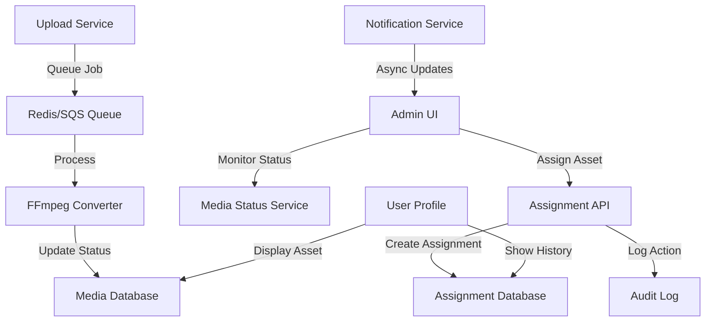
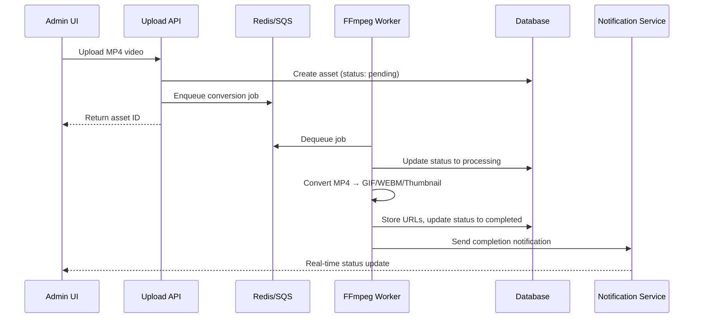
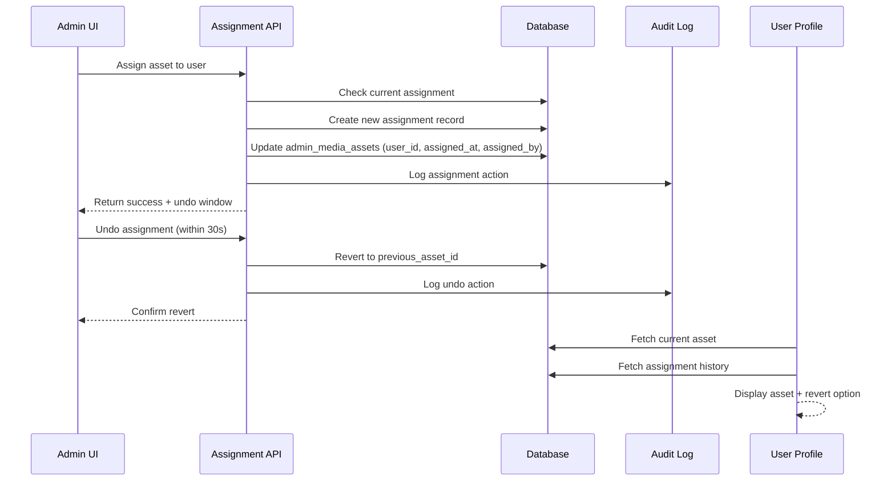
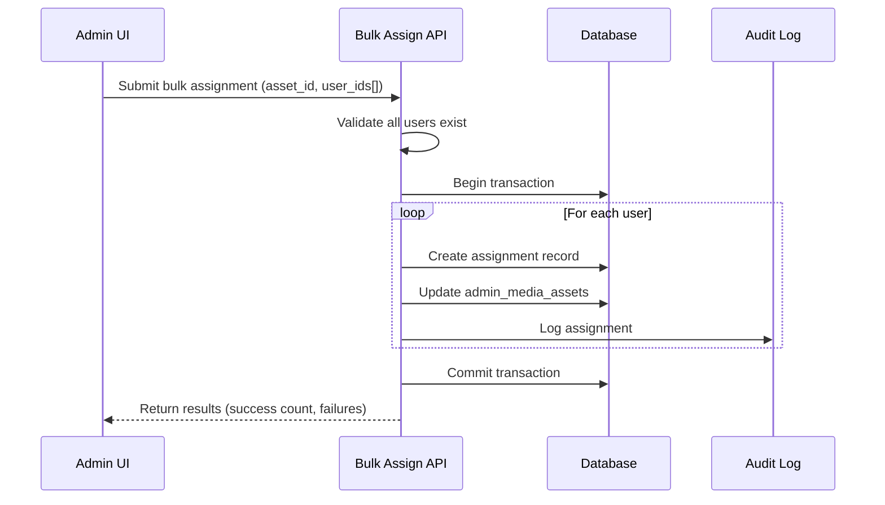

# Design Document: Media & Assignments

## Overview

Phase 9 implements a comprehensive media conversion and asset assignment system for living feature assets. The system enables background video conversion (MP4 to GIF, WEBM, thumbnail) through a queue-based processor, while providing administrators with the ability to assign media assets to users with immediate undo capability and full audit trails. The design prioritizes data integrity through soft deletes, maintains assignment history for compliance, and integrates seamlessly with existing UI components.

## Architecture



## Sequence Diagrams

### Media Conversion Flow



### Asset Assignment Flow



### Bulk Assignment Flow



## Components and Interfaces

### Component 1: Media Converter Service

**Purpose**: Processes video uploads asynchronously, converting MP4 to multiple formats and generating thumbnails.

**Interface**:
```typescript
interface MediaConverterService {
  // Queue a new conversion job
  queueConversion(assetId: string, videoPath: string): Promise<JobId>
  
  // Get conversion status
  getConversionStatus(assetId: string): Promise<ConversionStatus>
  
  // Handle conversion completion
  handleConversionComplete(jobId: string, results: ConversionResults): Promise<void>
  
  // Handle conversion failure with retry logic
  handleConversionFailure(jobId: string, error: Error): Promise<void>
}
```

**Responsibilities**:
- Enqueue conversion jobs to Redis/SQS
- Track job status (pending → processing → completed/failed)
- Coordinate with FFmpeg worker processes
- Notify subscribers of status changes
- Implement retry logic for failed conversions

### Component 2: Assignment Service

**Purpose**: Manages asset assignments to users with immediate undo capability and full audit trails.

**Interface**:
```typescript
interface AssignmentService {
  // Assign asset to user
  assignAsset(assetId: string, userId: string, assignedBy: string): Promise<Assignment>
  
  // Undo assignment within 30-second window
  undoAssignment(assetId: string, userId: string): Promise<void>
  
  // Get assignment history for user
  getAssignmentHistory(userId: string, limit?: number): Promise<Assignment[]>
  
  // Revert to previous assignment
  revertAssignment(userId: string, targetAssignmentId: string): Promise<Assignment>
  
  // Bulk assign asset to multiple users
  bulkAssignAsset(assetId: string, userIds: string[], assignedBy: string): Promise<BulkAssignResult>
}
```

**Responsibilities**:
- Create and manage assignment records
- Enforce 30-second undo window
- Maintain assignment history
- Track previous asset assignments
- Implement soft deletes (mark as reverted, don't remove)
- Audit all assignment changes

### Component 3: Audit Logger

**Purpose**: Maintains immutable audit trail of all media and assignment operations.

**Interface**:
```typescript
interface AuditLogger {
  // Log assignment action
  logAssignment(action: AssignmentAction, details: AuditDetails): Promise<void>
  
  // Log conversion status change
  logConversionStatusChange(assetId: string, status: ConversionStatus, details: any): Promise<void>
  
  // Retrieve audit trail
  getAuditTrail(filters: AuditFilters): Promise<AuditEntry[]>
}
```

**Responsibilities**:
- Record who performed each action
- Record what action was performed
- Record when action occurred
- Store action details and outcomes
- Provide queryable audit trail

### Component 4: Notification Service

**Purpose**: Delivers real-time status updates to UI components.

**Interface**:
```typescript
interface NotificationService {
  // Subscribe to conversion status updates
  subscribeToConversionStatus(assetId: string, callback: (status: ConversionStatus) => void): Unsubscribe
  
  // Subscribe to assignment updates
  subscribeToAssignmentUpdates(userId: string, callback: (assignment: Assignment) => void): Unsubscribe
  
  // Publish status change
  publishConversionStatusChange(assetId: string, status: ConversionStatus): Promise<void>
  
  // Publish assignment change
  publishAssignmentChange(userId: string, assignment: Assignment): Promise<void>
}
```

**Responsibilities**:
- Maintain subscription registry
- Deliver real-time updates via WebSocket or polling
- Handle subscriber cleanup
- Ensure message delivery reliability

## Data Models

### Model 1: admin_media_assets (Extended)

```typescript
interface AdminMediaAsset {
  id: string                    // UUID
  filename: string              // Original filename
  file_path: string             // S3/storage path
  file_size: number             // Bytes
  mime_type: string             // video/mp4, etc.
  
  // Conversion fields
  conversion_status: 'pending' | 'processing' | 'completed' | 'failed'
  gif_url?: string              // Converted GIF URL
  webm_url?: string             // Converted WEBM URL
  thumbnail_url?: string        // Generated thumbnail URL
  conversion_error?: string     // Error message if failed
  
  // Assignment fields
  user_id?: string              // Currently assigned user
  assigned_at?: Date            // When assigned
  assigned_by?: string          // Admin who assigned
  
  // Metadata
  created_at: Date
  updated_at: Date
  deleted_at?: Date             // Soft delete timestamp
}
```

**Validation Rules**:
- `conversion_status` must be one of: pending, processing, completed, failed
- `gif_url`, `webm_url`, `thumbnail_url` must be valid URLs when status is completed
- `user_id` must reference valid user when assigned
- `assigned_by` must reference valid admin user
- Cannot assign asset with status other than completed

### Model 2: asset_assignments

```typescript
interface AssetAssignment {
  id: string                    // UUID
  asset_id: string              // Reference to admin_media_assets
  user_id: string               // Reference to user
  previous_asset_id?: string    // Previous asset for this user
  assigned_by: string           // Admin who performed assignment
  assigned_at: Date             // Assignment timestamp
  reverted_at?: Date            // When reverted (soft delete)
  reverted_by?: string          // Admin who reverted
  revert_reason?: string        // Why it was reverted
  
  created_at: Date
  updated_at: Date
}
```

**Validation Rules**:
- `asset_id` must reference valid completed asset
- `user_id` must reference valid user
- `assigned_by` must reference valid admin
- `previous_asset_id` must reference valid asset if provided
- Cannot revert assignment after 30 seconds

### Model 3: assignment_history

```typescript
interface AssignmentHistory {
  id: string                    // UUID
  user_id: string               // User being assigned to
  asset_id: string              // Asset assigned
  previous_asset_id?: string    // Previous asset
  action: 'assigned' | 'reverted' | 'bulk_assigned'
  performed_by: string          // Admin who performed action
  performed_at: Date            // Action timestamp
  reason?: string               // Reason for action
  metadata?: Record<string, any> // Additional context
  
  created_at: Date
}
```

**Validation Rules**:
- `action` must be one of: assigned, reverted, bulk_assigned
- `user_id` and `asset_id` must reference valid records
- `performed_by` must reference valid admin
- Immutable after creation

### Model 4: queue_jobs

```typescript
interface QueueJob {
  id: string                    // UUID or job ID from queue
  asset_id: string              // Asset being converted
  job_type: 'convert_media'     // Type of job
  status: 'pending' | 'processing' | 'completed' | 'failed'
  input_path: string            // Path to input video
  output_paths?: {              // Paths to converted files
    gif?: string
    webm?: string
    thumbnail?: string
  }
  error?: string                // Error message if failed
  retry_count: number           // Number of retry attempts
  max_retries: number           // Maximum retry attempts
  
  created_at: Date
  started_at?: Date
  completed_at?: Date
}
```

**Validation Rules**:
- `status` must be one of: pending, processing, completed, failed
- `retry_count` must not exceed `max_retries`
- `input_path` must be valid and accessible
- `output_paths` must be populated when status is completed

## Error Handling

### Error Scenario 1: Conversion Failure

**Condition**: FFmpeg conversion fails (corrupted video, unsupported codec, disk space)
**Response**: 
- Mark job as failed with error message
- Retry up to 3 times with exponential backoff
- After max retries, mark asset as failed
- Notify admin of failure
**Recovery**: 
- Admin can re-upload video
- Failed asset remains in database for audit trail
- Admin can manually trigger retry

### Error Scenario 2: Assignment to Non-Existent User

**Condition**: User ID provided doesn't exist in system
**Response**: 
- Reject assignment with validation error
- Return 404 with descriptive message
**Recovery**: 
- Admin verifies user ID
- Retry assignment with correct user ID

### Error Scenario 3: Undo Window Expired

**Condition**: Admin attempts to undo assignment after 30 seconds
**Response**: 
- Reject undo request
- Return 410 Gone with message indicating window expired
**Recovery**: 
- Use revert-assignment endpoint instead
- Requires explicit confirmation

### Error Scenario 4: Concurrent Assignment Conflict

**Condition**: Two admins attempt to assign different assets to same user simultaneously
**Response**: 
- Use database transaction to ensure atomicity
- Last write wins with conflict logged
- Notify both admins of conflict
**Recovery**: 
- Audit log shows both attempts
- Admin can revert and reassign if needed

## Testing Strategy

### Unit Testing Approach

**Media Converter Service**:
- Test job queueing with various video formats
- Test status tracking state transitions
- Test retry logic with simulated failures
- Test error handling for invalid inputs
- Mock FFmpeg and queue dependencies

**Assignment Service**:
- Test assignment creation and validation
- Test 30-second undo window enforcement
- Test assignment history retrieval
- Test bulk assignment with transaction rollback
- Test soft delete behavior
- Test concurrent assignment handling

**Audit Logger**:
- Test audit entry creation with all required fields
- Test audit trail filtering and retrieval
- Test immutability of audit records

### Property-Based Testing Approach

**Property Test Library**: fast-check (JavaScript/TypeScript)

**Key Properties**:
- Assignment history is immutable: Once logged, audit entries cannot be modified
- Undo window is strictly enforced: Undo only succeeds within 30 seconds
- Previous asset tracking is consistent: Each assignment correctly references previous asset
- Bulk assignment is atomic: Either all assignments succeed or all fail
- Conversion status transitions are valid: Only allowed state transitions occur
- Soft deletes preserve data: Deleted assignments remain in database with reverted_at timestamp

### Integration Testing Approach

- Test full media upload → conversion → assignment flow
- Test assignment → undo → reassignment flow
- Test bulk assignment with multiple users
- Test concurrent operations with race conditions
- Test notification delivery to UI components
- Test database transaction rollback scenarios

## Performance Considerations

- **Queue Processing**: Use Redis/SQS for scalable job distribution; process multiple conversions in parallel
- **Database Indexing**: Index on `user_id`, `asset_id`, `assigned_at` for fast queries
- **Soft Deletes**: Use indexed `reverted_at` column to efficiently filter active assignments
- **Bulk Operations**: Batch database inserts for bulk assignments (1000+ users)
- **Caching**: Cache conversion status in Redis with TTL for frequently accessed assets
- **Pagination**: Implement cursor-based pagination for assignment history (large datasets)

## Security Considerations

- **Authorization**: Only admins can assign/revert assets; verify admin role on every operation
- **Audit Trail**: Immutable audit log prevents tampering; log all assignment changes
- **Data Validation**: Validate all user IDs and asset IDs before operations
- **Soft Deletes**: Never permanently delete assignments; maintain compliance trail
- **Rate Limiting**: Limit bulk assignment requests to prevent abuse
- **File Validation**: Validate video files before queuing conversion (size, format, duration)
- **Access Control**: Restrict assignment history access to authorized admins only

## Dependencies

- **FFmpeg**: Video conversion library (external process)
- **Redis or SQS**: Job queue for async processing
- **Database**: PostgreSQL or similar for transactional support
- **WebSocket or Polling**: Real-time notification delivery
- **S3 or similar**: Storage for converted media files
- **UUID library**: For generating unique IDs
